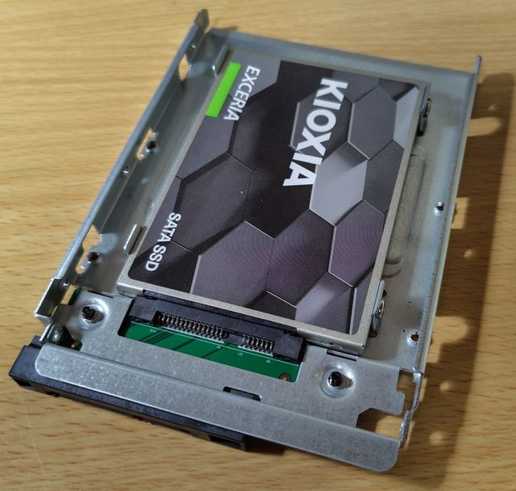
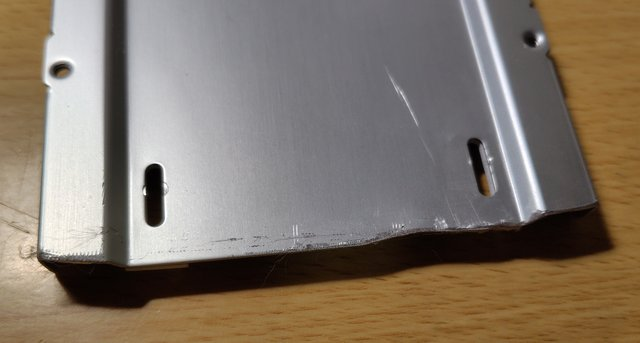
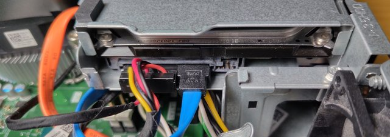
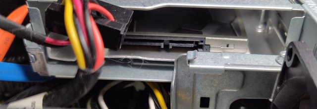
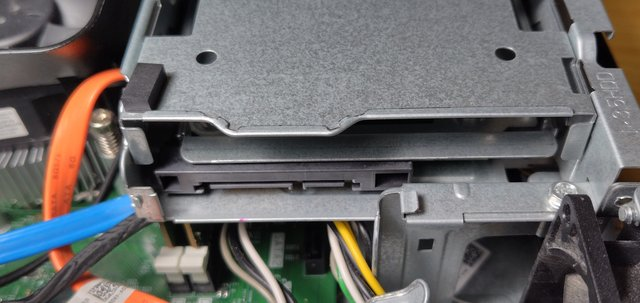

.. -*- coding: utf-8; mode: rst; -*-

.. index:: dell, ssd

.. _dell-ssd:

DELL Inspiron 3268 3.5 HDD を 2.5 SSDに換装(物理)
=================================================

2024年11月4日

古いマシンを延命しようと 3.5HDD を SSDに換装することにしました。
DELLなので一癖あります。

結論
----

2.5 → 3.5 変換ブラケットは 3.5HDDとコネクタの位置を合わせられるタイプのを入手してください。
3.5 の HDDを見れば分かるようにコネクタ位置は真ん中ではなくて(上面から見て)左端に寄っています。

筆者が入手したのは「DSLRKIT 2.5 → 3.5変換 2.5インチ HDD/SSD 変換 SATAインターフェース内蔵 HDDケース 3.5インチ 変換ブラケット ネジ付き」
(既に別売のSSDを装着した状態です)。

DELLから入手した「Inspiron 3268 サービスマニュアル」に従って 3.5 HDD を取り出し、 代わりに SSD を装着した上記等ブラケットを装着します。

.. hint::

   ブラケットをDELLの3.5HDD用ケース(?)に装着する際は、
   以下のようにして手元のメモ帳(メモブロック)をスペーサーにしてネジ止めしました。

   .. image:: ./241031095932678.JPG

単なるブラケットでいいんじゃねーの？
------------------------------------

単なる金具であるブラケットでいいんじゃねーの安いし。とよくある2.5→3.5ブラケットを買いました
(写真のは、 組み込む時、筐体の出っ張りと干渉したので端っこをちょっと削ってます)。

元々は 3.5 HDD が このようにセットされています。

単なるブラケットを使うとコネクタ位置が中央に来るのでこうなります…筐体の謎の出っ張りと干渉してSATAケーブルが挿さりませんorz

コネクタ位置が3.5HDDに合わせてある変換ブラケットを使った場合

