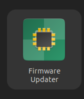
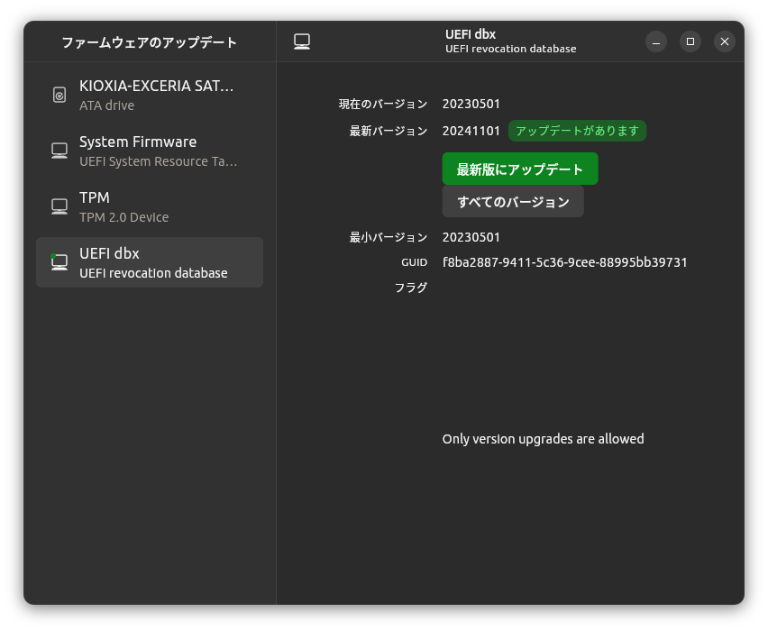

.. -*- coding: utf-8; mode: rst; -*-

.. index:: linux

grub-efi-amd64-signed 更新不可
==============================

- 2025年3月4日

apt dist-upgrade でエラーが出る

.. code-block:: text

   $ sudo apt dist-upgrade

   (中略)

   grub-efi-amd64-signed (1.202.2+2.12-1ubuntu7.1) を設定しています ...
   mount: /var/lib/grub/esp: スペシャルデバイス /dev/disk/by-id/ata-ST1000DM010-2EP102_Z9AMDR8J-part1 が存在しません.
   dmesg(1) may have more information after failed mount system call.
   dpkg: パッケージ grub-efi-amd64-signed の処理中にエラーが発生しました (--configure):
   installed grub-efi-amd64-signed package post-installation script subprocess returned error exit status 32

   (中略)

   dpkg: 依存関係の問題により shim-signed のトリガの処理ができません:
   shim-signed は以下に依存 (depends) します: grub-efi-amd64-signed (>= 1.191~) | grub-efi-arm64-signed (>= 1.191~) | base-files (<< 12.3) ...しかし:
   パッケージ grub-efi-amd64-signed はまだ設定されていません。
   パッケージ grub-efi-arm64-signed はまだインストールされていません。
   システム上の base-files のバージョンは 13ubuntu10.2 です。
   shim-signed は以下に依存 (depends) します: grub-efi-amd64-signed (>= 1.187.2~) | grub-efi-arm64-signed (>= 1.187.2~) ...
   しかし:
   パッケージ grub-efi-amd64-signed はまだ設定されていません。
   パッケージ grub-efi-arm64-signed はまだインストールされていません。

   dpkg: パッケージ shim-signed の処理中にエラーが発生しました (--configure):
   依存関係の問題 - トリガを未処理のままにします
   dbus (1.14.10-4ubuntu4.1) のトリガを処理しています ...
   hicolor-icon-theme (0.17-2) のトリガを処理しています ...
   処理中にエラーが発生しました:
   grub-efi-amd64-signed
   shim-signed
   E: Sub-process /usr/bin/dpkg returned an error code (1)

参考
----

`【Ubuntu 22.04】grub-efi-amd64-signed設定エラーの解決: /var/lib/grub/espマウント問題 <https://zenn.dev/shosampo/articles/4bff9a92c02898>`_

対処
----

参考の通りに /var/cache/debconf/config.dat の中で /dev/disk/by-id/ata-ST1000DM010-2EP102_Z9AMDR8J-part1 を探す。

.. code-block:: text
   :caption: /var/cache/debconf/config.dat(抜粋)

   Name: grub-efi/install_devices
   Template: grub-efi/install_devices
   Value: /dev/disk/by-id/ata-ST1000DM010-2EP102_Z9AMDR8J-part1
   Owners: grub-common, grub-efi-amd64
   Flags: seen
   Variables:
    CHOICES = /dev/sda1 (536 MB; /boot/efi) on 1000204 MB ST1000DM010-2EP102
    RAW_CHOICES = /dev/disk/by-id/ata-ST1000DM010-2EP102_Z9AMDR8J-part1

   Name: grub-efi/install_devices_disks_changed
   Template: grub-efi/install_devices_disks_changed
   Value: /dev/disk/by-id/ata-ST1000DM010-2EP102_Z9AMDR8J-part1, /dev/disk/by-id/ata-KIOXIA-EXCERIA_SATA_SSD_14TB804KK0Z5-part1
   Owners: grub-common, grub-efi-amd64
   Flags: seen
   Variables:
   CHOICES = 
   RAW_CHOICES =

HDDからSSDに換装したために発生した問題っぽい。

編集に備えて念の為ファイルのバックアップを取る。
   
.. code-block:: bash

   $ sudo /var/cache/debconf/config.dat /var/cache/debconf/config.dat.bak-20250304

そして /var/cache/debconf/config.dat から 上記抜粋部分をまるっと削除して、

以下を実行。

.. code-block:: text

   $ sudo dpkg-reconfigure grub-efi-amd64-signed
   /usr/sbin/dpkg-reconfigure: grub-efi-amd64-signed は壊れているか、完全にインストー ルされていません

   $ sudo apt install --reinstall grub-efi-amd64-signed
   パッケージリストを読み込んでいます... 完了
   依存関係ツリーを作成しています... 完了        
   状態情報を読み取っています... 完了        
   アップグレード: 0 個、新規インストール: 0 個、再インストール: 1 個、削除: 0 個、保 留: 0 個。
   1 個のパッケージが完全にインストールまたは削除されていません。
   この操作後に追加で 0 B のディスク容量が消費されます。
   E: Internal Error, No file name for grub-efi-amd64-signed:amd64

   $ sudo dpkg --configure -a
   grub-efi-amd64-signed (1.202.2+2.12-1ubuntu7.1) を設定しています ...
   Trying to migrate /boot/efi into esp config
   Installing grub to /boot/efi.
   Installing for x86_64-efi platform.
   Installation finished. No error reported.
   shim-signed (1.58+15.8-0ubuntu1) のトリガを処理しています ...
   No DKMS modules installed.

   $ sudo apt update
   ヒット:1 http://security.ubuntu.com/ubuntu noble-security InRelease               
   ヒット:2 http://jp.archive.ubuntu.com/ubuntu noble InRelease                      
   ヒット:3 http://jp.archive.ubuntu.com/ubuntu noble-updates InRelease
   ヒット:4 http://jp.archive.ubuntu.com/ubuntu noble-backports InRelease
   パッケージリストを読み込んでいます... 完了
   依存関係ツリーを作成しています... 完了
   状態情報を読み取っています... 完了        
   パッケージはすべて最新です。

   $ sudo apt dist-upgrade
   パッケージリストを読み込んでいます... 完了
   依存関係ツリーを作成しています... 完了        
   状態情報を読み取っています... 完了        
   アップグレードパッケージを検出しています... 完了
   Get more security updates through Ubuntu Pro with 'esm-apps' enabled:
       emacs vlc-plugin-qt libvlc5 vlc-data libvlccore9 vlc vlc-bin vlc-l10n
       libcjson1 emacs-gtk libpostproc57 vlc-plugin-samba libswscale-dev
       libavcodec60 libavcodec60 vlc-plugin-notify libavutil58 libavutil58
       libswscale7 vlc-plugin-access-extra libavutil-dev vlc-plugin-skins2 emacs-el
       vlc-plugin-video-splitter libswresample4 libswresample4
       vlc-plugin-video-output libavformat60 emacs-common libavformat-dev
       libavcodec-dev libvlc-bin emacs-bin-common libswresample-dev vlc-plugin-base
       vlc-plugin-visualization libavfilter9
   Learn more about Ubuntu Pro at https://ubuntu.com/pro
   アップグレード: 0 個、新規インストール: 0 個、削除: 0 個、保留: 0 個。

reboot。正常に起動した。

UEFI アップデート
-----------------

手元では更に UEFI のアップデートを行う必要がありました。

起動後しばらくして、なんや通知に出てくる。「不明なapp」から UEFI ほげほげ install のボタン。
通知が消えちゃった場合は Firmware Updater を起動して下さい。

.. code-block:: bash

   $ firmware-updater &

または下記アイコンをクリックして起動

起動すると更新を求められるので

ボタン押してアップデートして再び再起動して完了。
