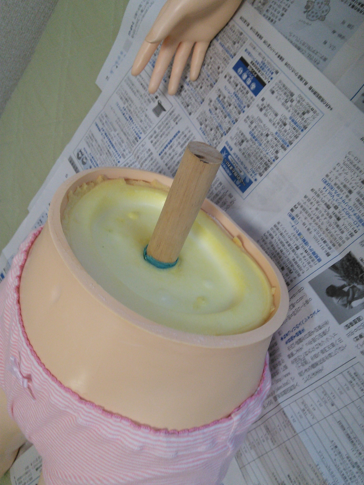

.. -*- coding: utf-8; mode: rst; -*-

ピュアボディ腰部接合部修理
==========================

2017年07月02日

- ファンタスティックブランド（オリエント工業製）
- ピュアボディ（立像タイプ）
- 2004年9月お迎え    

修理前の状態
------------

腰の接合部が剥がれて上半身下半身に分離。
専用スタンドが脇の下で支える構造のため、足が床から浮き気味となり、
下半身自身の荷重と、ソフビの経年による収縮で接合部が剥がれたものと思われる。

修正箇所
--------

発泡材盛り上がりを是正
......................

ソフトビニール(肌色)の接合面より発泡材が土手のように膨らんでいる。
ソフトビニールの収縮によるものと思われ、
ソフトビニールの接合部がうまく合わさらないので、この部分を
ソフトビニールの接合面ツライチになるよう切削した。

カッターナイフで簡単に切削することができた。

接合面傾斜是正
..............

下半身ソフトビニール接合部が水平でなかった。
水平に近づける為、内側の山側を中心に外側のエッヂで水平に近づけるよう
切削した。カッターナイフで切削した。
	 

内側の山側を中心に外側のエッヂで水平に近づけるよう切削した。

接着
----

接着剤で接着し、接着面に圧を掛けるため倒立状態で固定。

今回利用した接着剤。硬化後も無色透明で弾力があるタイプ。

接着増し増し
............

圧が均等でなかったためか、結構隙間ができた。
隙間を埋めるよう更に接着剤を盛り、なるべく均等に圧が掛るよう固定。

