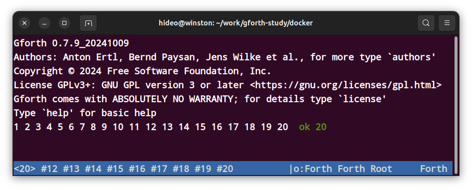
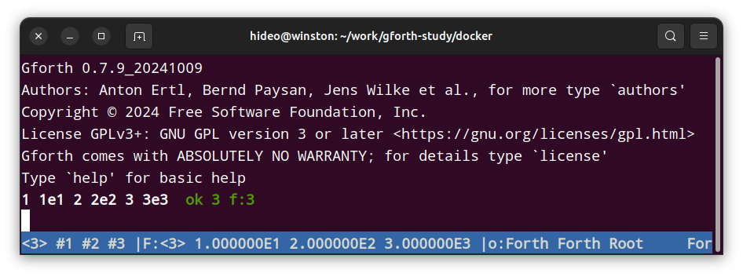

.. -*- coding: utf-8; mode: rst; -*-

.. index:: gforth

ちょいとお試しでGNU gforth Docker版を起動してみる
=================================================

- 更新:2024年12月20日

docker 版。 手元で試したのは Gforth 0.7.9_20241009 でした。

もってくる
----------

docker hub から もってくる https://hub.docker.com/r/forthy42/gforth

.. code:: bash
	  
   docker pull forthy42/gforth

お試し
------

.. code:: bash

   $ docker run -ti --rm forthy42/gforth

終了
----

bye

ふつうに実行
------------

.. note::
   
   出典: docker hub https://hub.docker.com/r/forthy42/gforth

.. code-block:: bash

   $ cat $(pwd)/test.fs
   .( huhu )
   $ docker run -ti -v$(pwd):/work forthy42/gforth
   s" /work/test.fs" included huhu ok
   bye
   $

カレントディレクトリに test.fs と言う名前でファイルを作る

内容は

.. code-block:: text

   .( huhu )

です。 .( ... ) は インタープリター時でもコンパイル時でもメッセージを出力するワード(コマンド)です。

.. warning::
   
   .( と huhu の間には空白が必要です。

.. code-block:: bash

   $ docker run -ti -v$(pwd):/work forthy42/gforth

で起動し、 その中で

.. code-block:: forth

   s" /work/test.fs" included[ENTER]

([ENTER]はエンター・キー押下)と入力すると、 「改行せずに」結果が huhu と出力され、 続けて「改行せずに」 ok と表示されます。
(改行されないのは gforth の仕様です)

画面
----

一番下のモードライン左側には現在のスタックの状態が表示されます(
TOS;スタック・トップから一部)
また、 .s でも非破壊的に見れます(同様にTOSから一部)

.. code-block:: 

   1 2 3 4 5 6 7 8 9 10 11 12 13 14 15 16 17 18 19 20 ok 20
   <20> #12 #13 #14 #15 #16 #17 #18 #19 #20

これは全体としては スタックに 20 個積まれていて、
そのうちの TOS 側 10 個だけが表示されています。
通常は一番右がTOSです。

そして「\|o Forth Forth Root     Forth」の部分は、 ワード(forthのコマンド) のライブラリ・カテゴリ(wordlist)検索順と、
これから定義されるワードが追加されるカテゴリ(wordlist)を示しています。
order でも同じ情報がでます。

.. code-block::

   order[ENTER]

([ENTER] は エンター・キーを押下)
   
.. code-block::

   order Forth Forth Root     Forth  ok 20

ok の後ろの数値はデータ・スタックに幾つ積まれているかを表しています。(画面下部の <20> や .s の <20> と同じ)。

浮動小数点数
............

浮動小数点数をスタックに積んだ場合

gforth には(主に)整数用のデータ・スタック(単にスタックというとこちら)と、
浮動小数点数スタック(Floating Point;FPスタック)があります。

上図のように、一緒に書いても整数と浮動小数点数は別々に格納されます。

データスタックの表示は .s です。

FPスタックの表示は f.s です。

よって、

.. code-block:: forth

   1 1e1 2 2e2 3 3e3  ok 3 f:3
   .s <3> 1 2 3  ok 3 f:3
   f.s <3> 1.0000000000E1 2.0000000000E2 3.0000000000E3  ok 3 f:3

スタッククリア
--------------

clearstacks

詳しい説明は
------------

オレオレ翻訳(gnu gforth 0.7.9_20240418)でスマンソ

https://kuma35.github.io/gforth-docs-ja/
