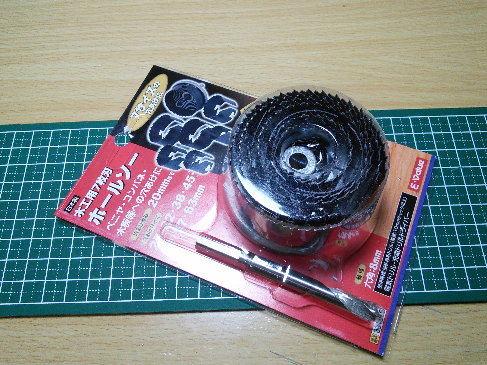
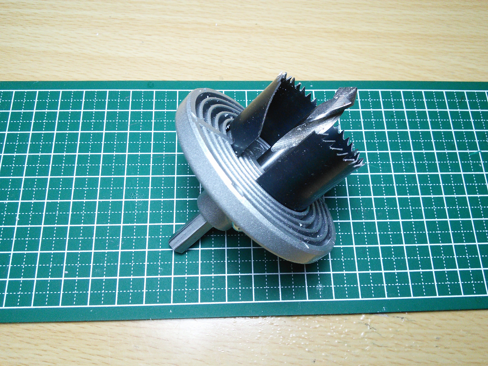
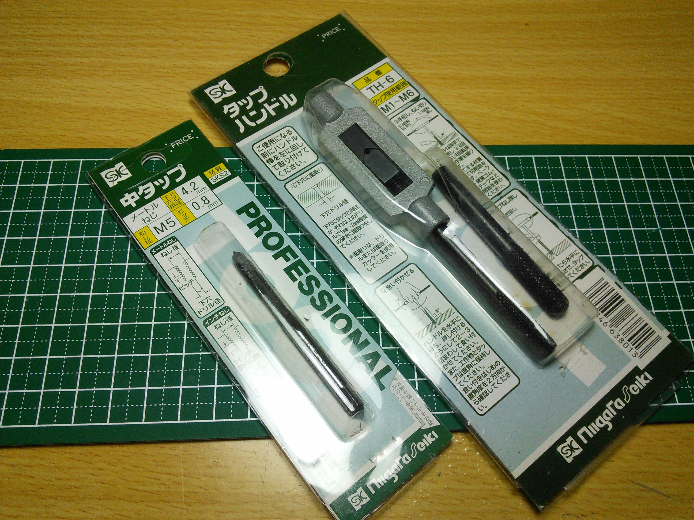

.. -*- coding: utf-8; mode: rst; -*-

ポリプロピレン(1mm厚)に38mm穴を穿孔
===================================

木工用ホールソーを使いました。

今回は下穴3mmを木工用ドリルで穿孔後ホールソーを使いました。

ポリプロピレンは食いつきが悪いので根気よく低速で数十秒回転させる。その後も時々確認しながら低速で根気よく。速度コントロールが重要なのでボール盤ではなく電動ドライバードリル使いました。

なお、写真の商品(amazon https://www.amazon.co.jp/gp/product/B003NVBNW2 )に関してはレビューにある通り、センタードリルを固定するネジのネジ穴にタッピングが必要でしたトホホ(ネジ径M5、ピッチ0.8mm中タップ)。

